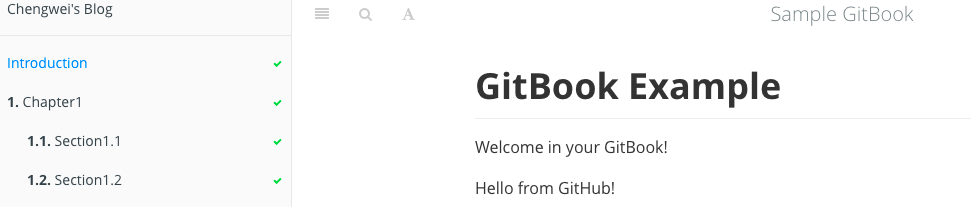

# book.json

gitbook 在编译书籍的时候会读取书籍源码顶层目录中的 `book.js` 或者 `book.json`，这里以 `book.json` 为例，参考 [gitbook 文档](https://github.com/GitbookIO/gitbook) 可以知道，`book.json` 支持如下配置：

```json
{
    // Folders to use for output
    // Caution: it overrides the value from the command line
    // It's not advised this option in the book.json
    "output": null,

    // Generator to use for building
    // Caution: it overrides the value from the command line
    // It's not advised this option in the book.json
    "generator": "site",

    // Book metadats (somes are extracted from the README by default)
    "title": null,
    "description": null,
    "isbn": null,

    // For ebook format, the extension to use for generation (default is detected from output extension)
    // "epub", "pdf", "mobi"
    // Caution: it overrides the value from the command line
    // It's not advised this option in the book.json
    "extension": null,

    // Plugins list, can contain "-name" for removing default plugins
    "plugins": [],

    // Global configuration for plugins
    "pluginsConfig": {
        "fontSettings": {
            "theme": "sepia", "night" or "white",
            "family": "serif" or "sans",
            "size": 1 to 4
        }
    },

    // Variables for templating
    "variables": {},

    // Links in template (null: default, false: remove, string: new value)
    "links": {
        // Custom links at top of sidebar
        "sidebar": {
            "Custom link name": "https://customlink.com"
        },

        // Sharing links
        "sharing": {
            "google": null,
            "facebook": null,
            "twitter": null,
            "weibo": null,
            "all": null
        }
    },


    // Options for PDF generation
    "pdf": {
        // Add page numbers to the bottom of every page
        "pageNumbers": false,

        // Font size for the fiel content
        "fontSize": 12,

        // Paper size for the pdf
        // Choices are [u’a0’, u’a1’, u’a2’, u’a3’, u’a4’, u’a5’, u’a6’, u’b0’, u’b1’, u’b2’, u’b3’, u’b4’, u’b5’, u’b6’, u’legal’, u’letter’]
        "paperSize": "a4",

        // Margin (in pts)
        // Note: 72 pts equals 1 inch
        "margin": {
            "right": 62,
            "left": 62,
            "top": 36,
            "bottom": 36
        },

        //Header HTML template. Available variables: _PAGENUM_, _TITLE_, _AUTHOR_ and _SECTION_.
        "headerTemplate": null,

        //Footer HTML template. Available variables: _PAGENUM_, _TITLE_, _AUTHOR_ and _SECTION_.
        "footerTemplate": null
    }
}
```

注意：上面的内容直接从 [gitbook 文档](https://github.com/GitbookIO/gitbook) 中复制，所以可能过期！

首先，将这个文件放到书籍代码顶层目录中，命名为 `book.json`，然后编译书籍：

```bash
$ gitbook build
```

可以看到，编译完成，使用

```bash
$ gitbook serve
```

然后将浏览器指向 `http://127.0.0.1:4000`，可以看到，什么都没有改变！

是的，虽然这里 `book.json` 文件非法，但是 `gitbook build` 并没有报错！所以，用户需要自己准备工具来保证 `book.json` 必须是一个合法的 JSON 文件，并且不能含有非法配置项。

首先，删除注释项，以及空行，如果是在 vim 中，可以执行下面的命令：

```vim
:%g/\s*\/\//d
:%g/^\s*$/d
```

然后，使用 python 来检查 book.json 是否合法，同样，在 vim 中执行下面的命令：

```vim
:%!python -m json.tool
```

很显然，下面的配置不能通过，所以删去（注：但是默认主题却是使用的这个配置！）。

```json
    "pluginsConfig": {
        "fontSettings": {
            "theme": "sepia", "night" or "white",
            "family": "serif" or "sans",
            "size": 1 to 4
        }
    },
```

最后，剩下的内容如下：

```json
{
    "description": null,
    "extension": null,
    "generator": "site",
    "isbn": null,
    "links": {
        "sharing": {
            "all": null,
            "facebook": null,
            "google": null,
            "twitter": null,
            "weibo": null
        },
        "sidebar": {}
    },
    "output": null,
    "pdf": {
        "fontSize": 12,
        "footerTemplate": null,
        "headerTemplate": null,
        "margin": {
            "bottom": 36,
            "left": 62,
            "right": 62,
            "top": 36
        },
        "pageNumbers": false,
        "paperSize": "a4"
    },
    "plugins": [],
    "title": null,
    "variables": {}
}
```

现在，修改一些配置，修改后为：

```json
{
    "author": "Chengwei Yang <me@chengweiyang.cn>",
    "description": "This is a sample book created by gitbook",
    "extension": null,
    "generator": "site",
    "isbn": null,
    "links": {
        "sharing": {
            "all": null,
            "facebook": null,
            "google": null,
            "twitter": null,
            "weibo": null
        },
        "sidebar": {
            "Chengwei's Blog": "http://www.chengweiyang.cn"
        }
    },
    "output": null,
    "pdf": {
        "fontSize": 12,
        "footerTemplate": null,
        "headerTemplate": null,
        "margin": {
            "bottom": 36,
            "left": 62,
            "right": 62,
            "top": 36
        },
        "pageNumbers": false,
        "paperSize": "a4"
    },
    "plugins": [],
    "title": "Sample GitBook",
    "variables": {}
}
```

现在，重新编译书籍，预览效果，如下图所示：



可以看到，书籍的标题变成了 "Sample GitBook"，而且在左边的导航栏中添加了一个链接！

需要注意的是：GitBook.com 上的书籍标题经试验不能通过配置 `book.json` 的方式修改 `title`，需要在书籍的属性页面中的 'Settings' 中进行修改！
