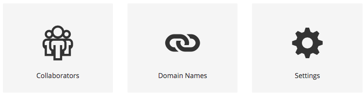
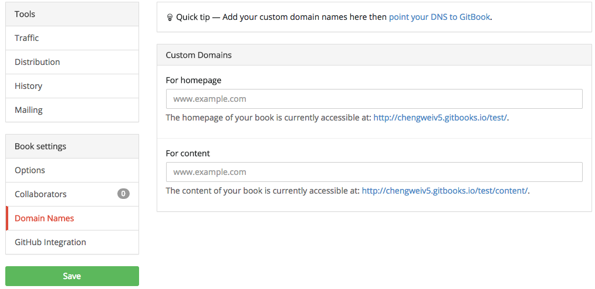
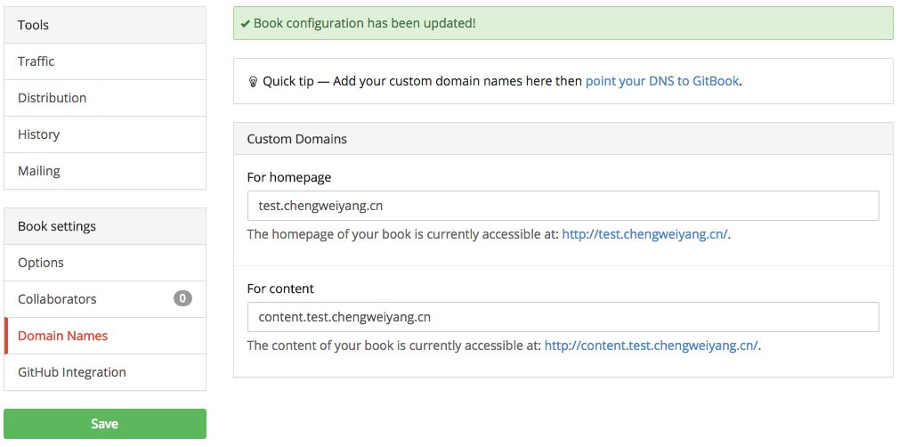
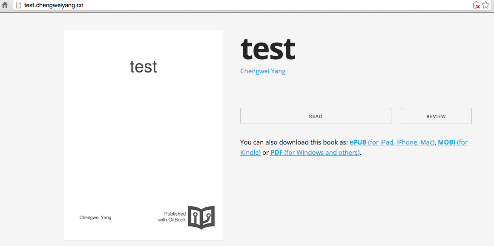
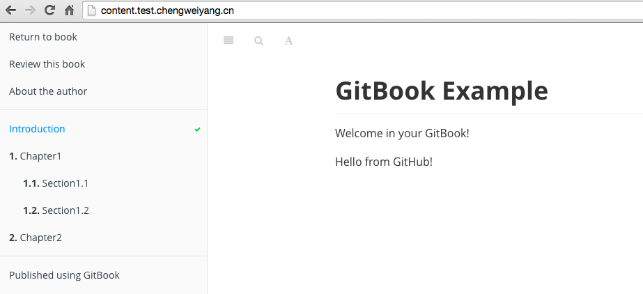

# 绑定域名

除了可以使用类似 `http://chengweiv5.gitbooks.io/test/content/index.html` 地址访问用户的书籍外，还可以为每本书绑定域名，前提是用户有自己的域名。

这里继续以 test book 为例，将其绑定到 test.chengweiyang.cn，这样，用户就可以通过新的域名访问本书！

## 修改书籍的域名配置

首先，在书籍的属性页面找到 "Domain Names" 属性，如下图：



点击 "Domain Names"，进入配置页面，如下图：



分别为书籍的封面和内容设置一个域名，如下图所示：



需要注意的是：这里只能是一个合法的域名，不能是域名下的某个地址，例如：`chengweiyang.cn/test`, `chengweiyang.cn/test/content`。

## 配置域名

将书籍的访问地址修改为个人的域名后，还需要让个人域名能够找到书籍的内容，这里参考 [gitbook 文档](http://help.gitbook.io/book/domains.html) 来配置。主要的是要为你的域名添加子域名 CNAME，并且指向 gitbook.com，然后等待域名生效，可能需要几分钟到几小时不等。

这里不再演示怎样为你的域名添加 CNAME 记录，各个域名服务商提供的工具可能不同，所以用户可以咨询域名提供商获取帮助。

## 验证

可以使用 `nslookup` 来验证是否解析成功：

```bash
$ nslookup test.chengweiyang.cn
Server:         10.11.50.66
Address:        10.11.50.66#53

Non-authoritative answer:
test.chengweiyang.cn    canonical name = www.gitbook.com.
www.gitbook.com canonical name = saga-4658.herokussl.com.
saga-4658.herokussl.com canonical name = elb049689-1604000308.us-east-1.elb.amazonaws.com.
Name:   elb049689-1604000308.us-east-1.elb.amazonaws.com
Address: 23.21.177.67
Name:   elb049689-1604000308.us-east-1.elb.amazonaws.com
Address: 23.21.212.67
Name:   elb049689-1604000308.us-east-1.elb.amazonaws.com
Address: 23.21.54.142

$ nslookup content.test.chengweiyang.cn
Server:         10.11.50.65
Address:        10.11.50.65#53

Non-authoritative answer:
content.test.chengweiyang.cn    canonical name = www.gitbook.com.
www.gitbook.com canonical name = saga-4658.herokussl.com.
saga-4658.herokussl.com canonical name = elb049689-1604000308.us-east-1.elb.amazonaws.com.
Name:   elb049689-1604000308.us-east-1.elb.amazonaws.com
Address: 23.21.212.67
Name:   elb049689-1604000308.us-east-1.elb.amazonaws.com
Address: 23.21.54.142
Name:   elb049689-1604000308.us-east-1.elb.amazonaws.com
Address: 23.21.177.67
```

现在，将浏览器指向 `http://test.chengweiyang.cn` 就可以看到书籍了。



点击 "READ" 按钮，或者直接将浏览器指向 `http://content.test.chengweiyang.cn` 就可以阅读书籍内容了！


