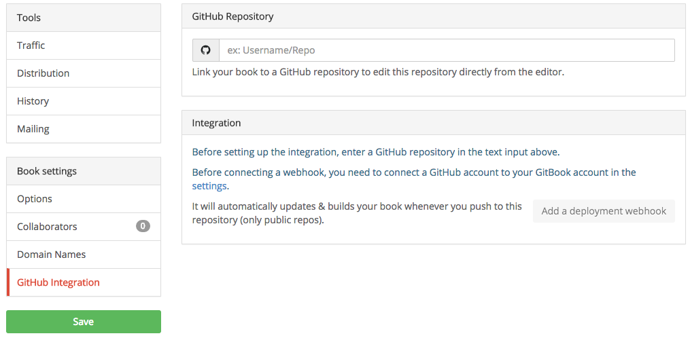
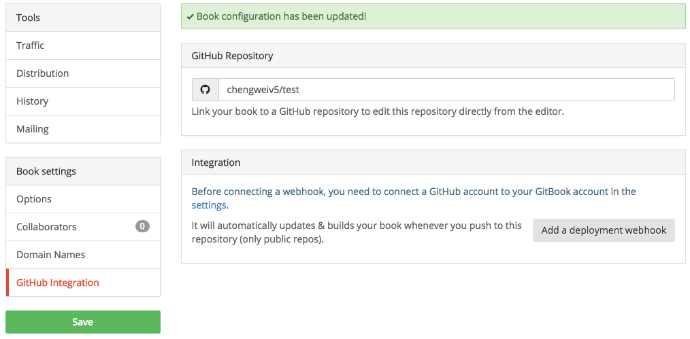
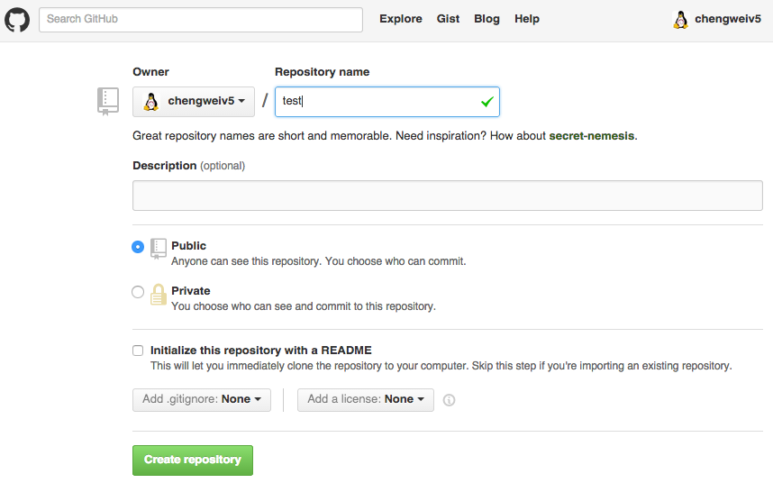
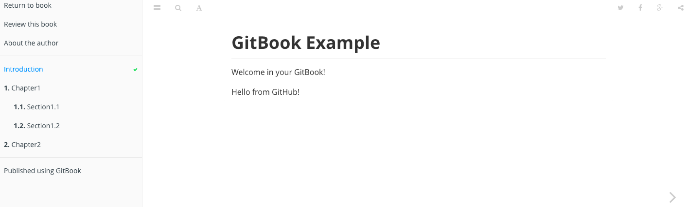

# GitHub 集成

GitBook.com 为每本书籍都创建了一个 Git 项目，并且使用这个 Git 项目来管理书籍源码（注意：这里的源码是指所有用户提交的内容）。正如在 [编辑书籍](/edit.html) 中介绍的那样，我们可以通过向书籍的 Git 项目提交内容来更新书籍。

另外，GitBook.com 还可以集成 [GitHub](https://github.com)，所以用户可以将书籍的源码通过 GitHub 上的项目来管理，这样可以使用 GitHub 带来的各种优点，例如：

- 其它用户可以 fork
- 用户可以点赞，获得更新提醒
- 用户可以贡献自己的内容

等等。

这里，接着之前的实例，将使用 GitHub 中的项目来替代 GitBook.com 上的项目 `https://git.gitbook.com/chengweiv5/test.git`。

## 使用 GitHub 上的项目

首先，将书籍的 Git 项目设置为 GitHub 上的项目，进入书籍属性页面，找到 "GitHub" 图标，如下图：


输入将要使用的 GitHub 上的项目，注意是公开的项目，如下图：



保存后，可以看到之前不可点击的 "Add a deployment webhook" 按钮已经可以点击了，这个按钮表示：每当用户配置的 GitHub 上的项目更新时，自动更新书籍！



## 创建 GitHub 项目

假设上面配置的 GitHub 中的项目并不存在，那么，首先，登陆 GitHub，然后创建一个 test 项目，如下图所示：



## 导入代码

现在，将书籍原来的 Git 项目内容导入到新建的 GitHub 中的项目中，假设已经将 `https://git.gitbook.com/chengweiv5/test.git` 项目克隆到了 test 目录：

```bash
$ cd test

$ git remote add github https://github.com/chengweiv5/test.git

$ git push -u github master
Counting objects: 31, done.
Delta compression using up to 4 threads.
Compressing objects: 100% (26/26), done.
Writing objects: 100% (31/31), 6.58 KiB | 0 bytes/s, done.
Total 31 (delta 7), reused 0 (delta 0)
To https://github.com/chengweiv5/test.git
 * [new branch]      master -> master
Branch master set up to track remote branch master from github.
```

`git push` 命令中的 `-u` 表示将本地 master 分支的上游分支设置为 github/master，所以以后修改了本地 master 分支后，`git push` 将推送到 github 上，而非原来的 `https://git.gitbook.com/chengweiv5/test.git`。

## 更新书籍

现在，可以通过提交变更到 GitHub 项目中来更新书籍了，例如：

```bash
$ git diff
diff --git a/README.md b/README.md
index e7b10b8..c776a52 100644
--- a/README.md
+++ b/README.md
@@ -2,3 +2,5 @@ GitBook Example
 =======
 
 Welcome in your GitBook!
+
+Hello from GitHub!

$ git commit  -asm "hello from github"
[master d985a79] hello from github
 1 file changed, 2 insertions(+)

$ git push
Counting objects: 3, done.
Delta compression using up to 4 threads.
Compressing objects: 100% (3/3), done.
Writing objects: 100% (3/3), 392 bytes | 0 bytes/s, done.
Total 3 (delta 0), reused 0 (delta 0)
To https://github.com/chengweiv5/test.git
   b6a8b3f..d985a79  master -> master
```


