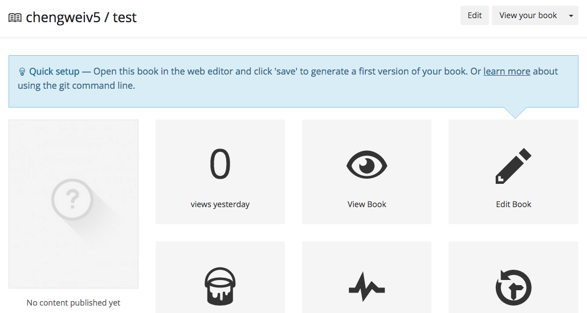
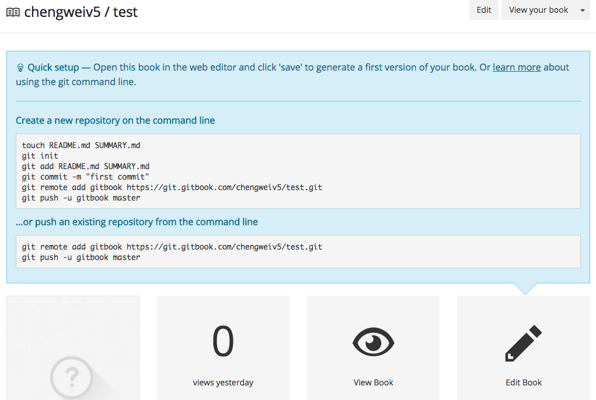
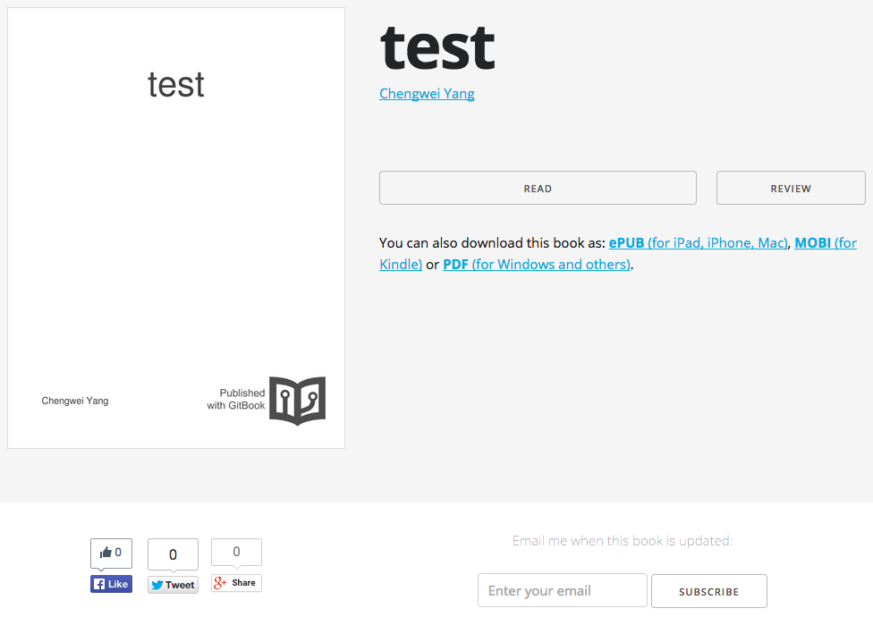
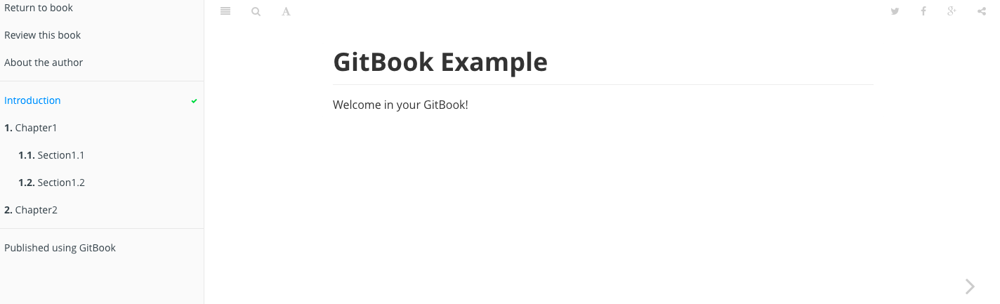

# 编辑书籍

在创建了书籍后，可以使用免费的在线编辑器进行编辑，也可以使用 [gitbook editor](https://www.gitbook.com/editor) 编辑，甚至使用任何喜欢的文本编辑器来编辑，例如：Vim。

## 在线编辑

进入到书籍的属性页面后，点击 "Edit Book" 按钮即可打开在线编辑器。

GitBook 的在线编辑器对于国内用户来说，很可能不能访问，所以最好还是下载 [gitbook editor](https://www.gitbook.com/editor) 到本地，安装后使用，或者使用自己喜欢的文本编辑器直接编辑。

## gitbook editor

gitbook editor 实际上就是一个本地应用版的在线编辑器，使用方式和在线编辑器类似，所见即所得，这里不再介绍，读者可以参考 [gitbook 使用](/basic-usage/README.html) 中的内容。

## Git & Markdown

另一种方式，是直接使用文本编辑器，编写 Markdown 文档，然后，使用 Git 提交到书籍的远程项目，当然，提交前，最好在本地使用 `gitbook` 预览效果；提交后，GitBook.com 会自动生成更新书籍的内容。

### 克隆书籍源代码

GitBook.com 上的每本书都使用 Git 项目来管理，所以，这里首先需要克隆需要编辑书籍的 Git 项目，登陆 GitBook.com 后，跳转到书籍的属性页面，如下图所示：



点击 "Edit Book" 上方的 "learn more"，将会展现此书籍的 Git 项目地址，以及简单的使用方法，如下图所示：



使用如下命令，克隆书籍的源代码：

```bash
$ git clone https://git.gitbook.com/chengweiv5/test.git
Cloning into 'test'...
remote: Counting objects: 28, done.
remote: Compressing objects: 100% (17/17), done.
remote: Total 28 (delta 6), reused 28 (delta 6)
Unpacking objects: 100% (28/28), done.
Checking connectivity... done.

$ cd test/

$ ls
README.md  SUMMARY.md

$ git log --oneline 
07bde6c Cleanup example
6d368db Add _book to gitignore
20779f5 Add explanation in README.md
1b5b1a6 Create chapter-1/ARTICLE1.md
77b1858 Add help message in SUMMARY.md
210e3fe Create chapter-1/README.md
5570112 Create SUMMARY.md
2a8a0c3 Initial commit
```

可以看到，创建好的书籍默认已经创建了一些内容，但是这些内容是还没有发布的，所以其它人不能阅读！

### 编辑内容

现在，可以参考 [gitbook 使用](/basic-usage/README.html) 中的内容来编辑书籍内容，使用 `gitbook init`, `gitbook serve` 来预览，完成后，可以提交修改：

```bash
$ git commit -asm "init book"
```

### 发布内容

最后，提交到远程 Git 项目：

```bash
$ git push 
Counting objects: 3, done.
Delta compression using up to 4 threads.
Compressing objects: 100% (3/3), done.
Writing objects: 100% (3/3), 362 bytes | 0 bytes/s, done.
Total 3 (delta 1), reused 0 (delta 0)
To https://git.gitbook.com/chengweiv5/test.git
   07bde6c..b6a8b3f  master -> master
```

### 阅读书籍

提交到 GitBook.com 后，书籍就自动发布了，用户就可以通过书籍的地址访问了，例如：`http://chengweiv5.gitbooks.io/test/`



点击 "READ" 按钮，就可以阅读书籍的内容了，如下图所示：


