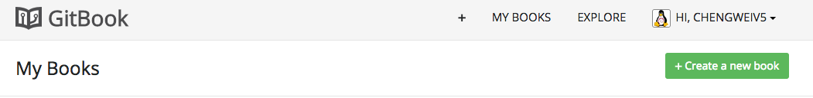
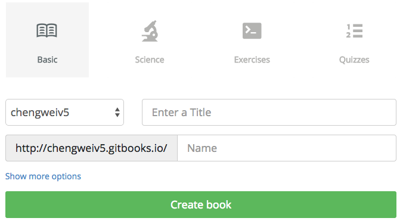

# 新建书籍

要使用 GitBook.com 来托管你的书籍，首先需要注册一个账号，免费注册后，用户也可以选择升级为付费用户，享受更多的服务！

登陆 [GitBook.com](https://www.gitbook.com) 后，在用户页面，可以管理现有书籍以及创建新的书籍，如下图：

点击 "+ Create a new book" 后，跳转到新建书籍页面，如下图：

目前有 4 中书籍主题可以选择，这里以默认的 `Basic` 主题为例，输入书籍名字后，点击 "Create book"，完成书籍的创建。

创建完成后，就会进入书籍属性页面，如下图所示：

这里可以进行对书籍的各个属性进行配置，例如：

- 编辑书籍（Edit Book）
- 书籍主题（Theme）
- 绑定 GitHub（GitHub）
- 绑定域名（Domain Names）

等。

以上几个配置将在后面介绍，其它的配置比较简单，请读者自行探索！
